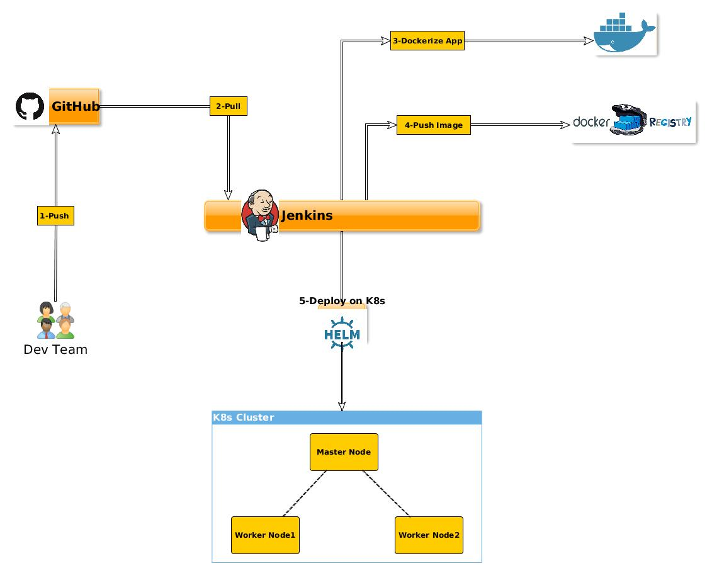
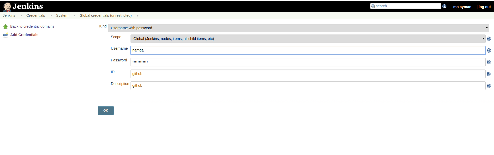

# NodeJs App -> Docker -> jenkins -> DockerHub -> helm -> Kubernetes

In this lab, we will achieve the CI/CD for a "Hello Kubernetes" NodeJS App using

  - Jenkins
  - Docker
  - DockerHub
  - Kubernetes
  - Helm package Manager

    


### Prepare Jenkins VM

  Install Java

    $ sudo apt update -y
    $ sudo apt upgrade -y
    $ sudo apt-get install default-jre -y

  Install Jenkins
  [Install Jenkins on Ubuntu 20.04](https://www.digitalocean.com/community/tutorials/how-to-install-jenkins-on-ubuntu-20-04)
  ```
  - for 8080 port conflict issues
     - Example : change sudo vi /etc/default/jenkins
           # port for HTTP connector (default 8080; disable with -1)
           HTTP_PORT=8888
  ```
  
  Start /Enable Jenkins on next Boot

    $ systemctl start jenkins
    $ systemctl enable jenkins
    $ cat /var/lib/jenkins/secrets/initialAdminPassword

    On your browser Jenkins-IP:8080, paste the previous password and select "Install suggested plugins"

  Install NodeJS to run unit test before dockerize the app

    $ curl -sSL https://deb.nodesource.com/gpgkey/nodesource.gpg.key | sudo apt-key add -
    $ echo "deb https://deb.nodesource.com/node_8.x Focal main" | sudo tee /etc/apt/sources.list.d/nodesource.list
    $ sudo apt install nodejs -y
    $ node -v   //v8.12.0
    $ sudo npm install -g mocha

  Installing Docker  

    $ curl -fsSL https://get.docker.com -o get-docker.sh
    $ sudo sh get-docker.sh

  Add User Jenkins to Docker Group

    $ sudo usermod -aG docker jenkins

  Installing the helm client

    - Download your desired version https://github.com/helm/helm/releases

    - Unpack it (tar -zxvf helm-v2.0.0-linux-amd64.tgz)

    - Find the helm binary in the unpacked directory, and move it to its desired destination (mv linux-amd64/helm /usr/local/bin/helm)

          $ wget https://storage.googleapis.com/kubernetes-helm/helm-v2.11.0-linux-amd64.tar.gz

          $ tar -xzvf helm-v2.11.0-linux-amd64.tar.gz

          $ sudo mv linux-amd64/helm /usr/local/bin/

          $ helm version

            Client: &version.Version{SemVer:"v2.11.0", GitCommit:"2e55dbe1fdb5fdb96b75ff144a339489417b146b", GitTreeState:"clean"}


   Installing Tiller

    Tiller, the server portion of Helm, typically runs inside of your Kubernetes cluster.

        $ su - jenkins

        -> copy k8s config under .kube/config

        $ helm init --upgrade

        $ kubectl get deployment -n kube-system --selector=app=helm
          NAME            DESIRED   CURRENT   UP-TO-DATE   AVAILABLE   AGE
          tiller-deploy   1         1         1            1           1m

        $ kubectl get pods -n kube-system --selector=app=helm
          NAME                            READY     STATUS    RESTARTS   AGE
          tiller-deploy-759b9d56c-wcpxx   1/1       Running   0          2m


### Creating a pipeline

  Create a Github and DockerHub creds Id "git, dockerhub"

    Go to jenkins-IP:8080/credentials/store/system/domain/ to add your git access with id

  

  Create "New Item" with "Pipeline" type, then copy the content under "jenkinsfiles/nodejs/Jenkinsfile" to the Pipeline and replace
  - the 2nd line with your repo
  - the 3rd line with dockerhub-username/repo-name
### Add Changes to the Code

  - under the repository, navigate "app/routes/root.js", change the "background-color" to red

  - run Jenkins pipline

  - Open your browser IP:30333
